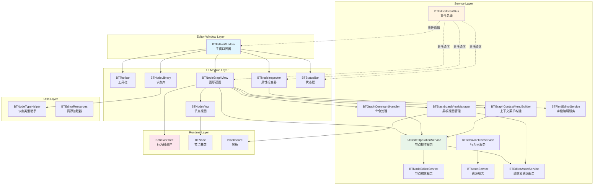
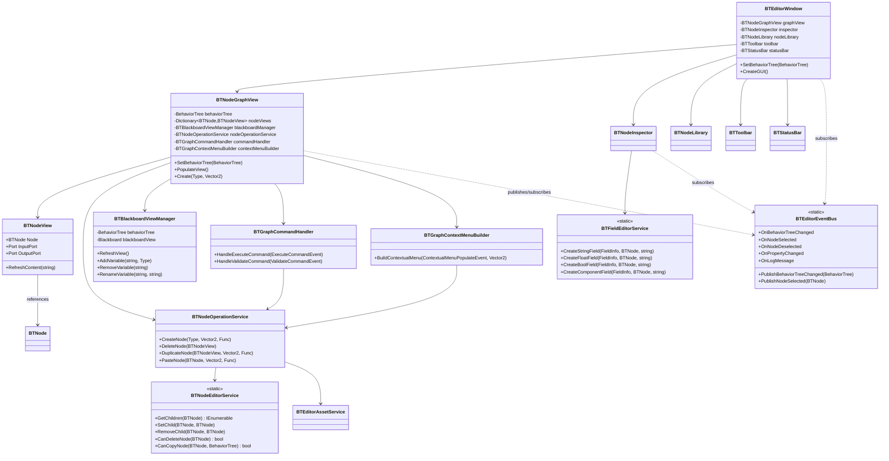
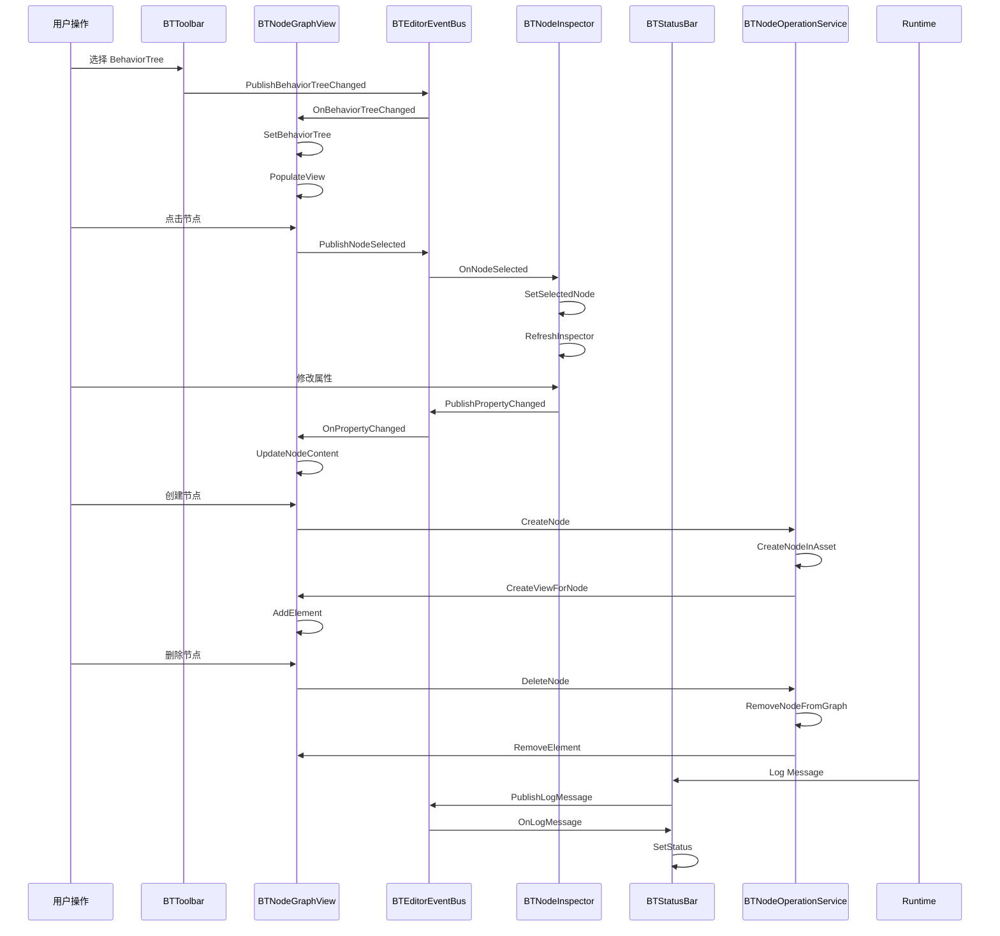
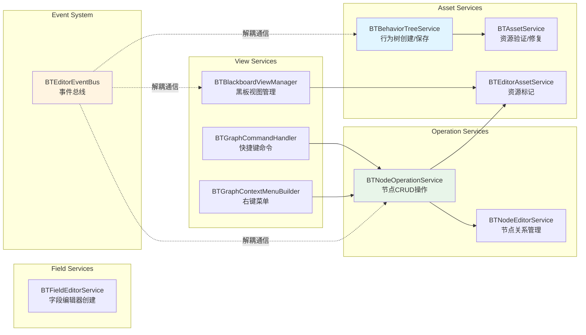
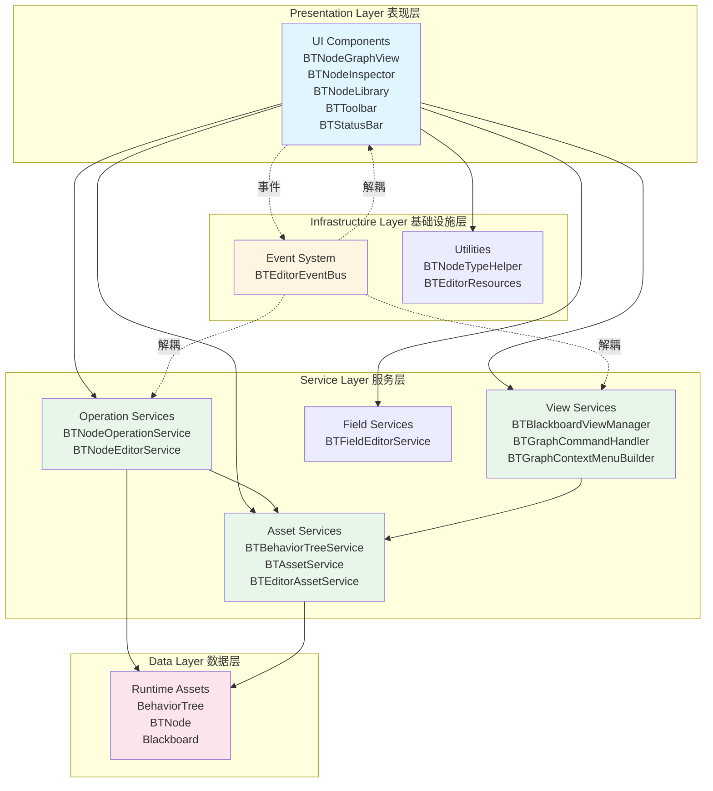

# MonsterBT Editor 架构文档

## 1. 整体架构图



## 2. 类关系图



## 3. 数据流和事件流图



## 4. 服务层架构图



## 5. UI 组件层次结构

```mermaid
graph TD
    BTEditorWindow[BTEditorWindow<br/>EditorWindow]
    
    BTEditorWindow --> ToolbarContainer[BTToolbar<br/>工具栏容器]
    BTEditorWindow --> MainContent[TwoPaneSplitView<br/>主内容区]
    BTEditorWindow --> StatusBarContainer[BTStatusBar<br/>状态栏]
    
    MainContent --> LeftPanel[BTNodeLibrary<br/>节点库面板]
    MainContent --> RightSplit[TwoPaneSplitView<br/>右侧分割]
    
    RightSplit --> CenterPanel[BTNodeGraphView<br/>图形视图]
    RightSplit --> InspectorPanel[BTNodeInspector<br/>属性检查器]
    
    CenterPanel --> BlackboardView[Blackboard<br/>Unity GraphView Blackboard]
    CenterPanel --> MiniMap[MiniMap<br/>小地图]
    CenterPanel --> GridBackground[GridBackground<br/>网格背景]
    CenterPanel --> NodeViews[BTNodeView[]<br/>节点视图集合]
    
    NodeViews --> NodeView1[BTNodeView<br/>节点1]
    NodeViews --> NodeView2[BTNodeView<br/>节点2]
    NodeViews --> NodeViewN[BTNodeView<br/>节点N]
    
    style BTEditorWindow fill:#e1f5ff
    style CenterPanel fill:#e8f5e9
    style InspectorPanel fill:#fff4e1
```

## 6. 职责分离架构



## 架构特点

### 1. 分层架构
- **表现层**: UI 组件，负责用户交互和视觉呈现
- **服务层**: 业务逻辑处理，职责单一
- **基础设施层**: 事件系统和工具类
- **数据层**: Runtime 资产

### 2. 职责分离
- **UI 组件**: 只负责显示和用户交互
- **服务类**: 处理业务逻辑和资产操作
- **事件总线**: 实现组件间解耦通信

### 3. 可扩展性
- 新节点类型自动发现和分类
- 新字段类型通过 `BTFieldEditorService` 扩展
- 新功能通过服务类添加，无需修改 UI

### 4. 设计模式
- **服务定位器模式**: 服务类集中管理
- **观察者模式**: 事件总线实现事件通信
- **策略模式**: 不同类型的字段编辑器
- 工厂模式: 节点和视图的创建
