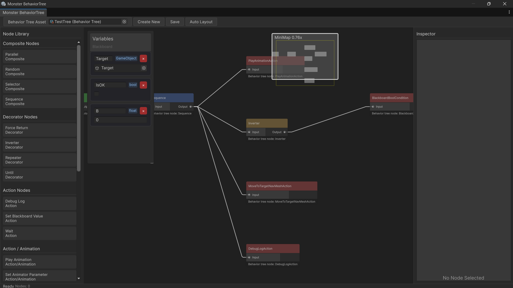

# MonsterBT

一个功能强大的 Unity 行为树编辑器插件，提供可视化节点编辑和运行时执行系统。



## 特性

- **可视化节点编辑器** - 直观的图形界面，支持拖拽和连接节点
- **自动布局** - 智能从左到右的节点自动排列
- **丰富的节点类型** - 支持 Action、Composite、Decorator、Condition 等节点
- **黑板系统** - 灵活的数据共享机制，支持多种数据类型
- **运行时执行** - 通过 BehaviorTreeRunner 组件轻松集成到游戏对象

## 系统要求

- 推荐 Unity 6000.3 以上
- .NET Standard 2.1

## 安装

### 方式一：通过 Unity Package Manager (推荐)

1. 打开 Unity 编辑器
2. 菜单栏选择 `Window > Package Manager`
3. 点击左上角 `+` 按钮，选择 `Add package from git URL...`
4. 输入以下地址：

```
https://github.com/Furry-Monster/MonsterBT.git?path=Assets/MonsterBT
```

5. 点击 `Add` 等待安装完成

#### 安装指定版本

如果需要安装特定版本，可以在 URL 后添加版本标签：

```
https://github.com/Furry-Monster/MonsterBT.git?path=Assets/MonsterBT#v1.0.0
```

### 方式二：修改 manifest.json

直接编辑项目的 `Packages/manifest.json` 文件，在 `dependencies` 中添加：

```json
{
  "dependencies": {
    "com.furry-monster.monsterbt": "https://github.com/Furry-Monster/MonsterBT.git?path=Assets/MonsterBT",
    ...
  }
}
```

### 方式三：手动安装

1. 下载本仓库的 ZIP 文件或克隆仓库
2. 将 `Assets/MonsterBT` 文件夹复制到你项目的 `Assets` 目录下

## 快速开始

### 1. 创建行为树

在 Unity 编辑器中：
1. 右键点击 Project 窗口
2. 选择 `Create > MonsterBT > BehaviorTree`
3. 双击创建的资源文件打开编辑器窗口

或通过菜单：`Window > MonsterBT > BehaviorTree`

### 2. 编辑行为树

在行为树编辑器中：
- **添加节点**：从节点库中拖拽节点到画布
- **连接节点**：拖拽节点的输出端口到目标节点的输入端口
- **自动布局**：点击工具栏的 "Auto Layout" 按钮自动排列节点
- **编辑属性**：选中节点后在检查器中修改属性

### 3. 运行行为树

在场景中：
1. 选择要运行行为树的 GameObject
2. 添加 `BehaviorTreeRunner` 组件
3. 将创建的行为树资源拖拽到 `Behavior Tree Asset` 字段
4. 运行游戏，行为树将自动执行

## 节点类型

### Composite（组合节点）

- **Sequence** - 顺序执行所有子节点，任一失败则返回失败
- **Selector** - 顺序执行子节点，任一成功则返回成功
- **Parallel** - 并行执行所有子节点
- **Random** - 随机选择一个子节点执行

### Decorator（装饰节点）

- **Inverter** - 反转子节点的返回结果
- **Repeater** - 重复执行子节点指定次数
- **Until** - 持续执行子节点直到满足条件
- **ForceReturn** - 强制返回指定状态

### Action（动作节点）

内置动作节点包括：
- **DebugLogAction** - 输出调试日志
- **WaitAction** - 等待指定时间
- **SetBlackboardValue** - 设置黑板值

#### 动画相关
- **PlayAnimationAction** - 播放动画
- **SetAnimatorParameterAction** - 设置动画器参数
- **WaitForAnimationAction** - 等待动画完成

#### 导航相关
- **MoveToPositionNavMeshAction** - 使用 NavMesh 移动到指定位置
- **MoveToTargetNavMeshAction** - 使用 NavMesh 移动到目标对象
- **SetNavMeshDestinationAction** - 设置 NavMesh 目标点

### Condition（条件节点）

条件节点用于检查特定条件，返回 Success 或 Failure。

## 黑板系统

黑板（Blackboard）用于在节点之间共享数据。支持的数据类型：
- `bool` - 布尔值
- `float` - 浮点数
- `string` - 字符串
- `Vector3` - 三维向量
- `GameObject` - 游戏对象引用
- `Transform` - 变换组件引用

### 使用示例

```csharp
// 在节点中访问黑板
var target = blackboard.GetGameObject("Target");
var health = blackboard.GetFloat("Health");

// 设置黑板值
blackboard.SetBool("IsChasing", true);
blackboard.SetVector3("TargetPosition", targetPosition);
```

## BehaviorTreeRunner 组件

`BehaviorTreeRunner` 是运行时执行行为树的组件，主要属性：

- **Behavior Tree Asset** - 要执行的行为树资源
- **Run On Start** - 是否在 Start 时自动运行
- **Loop** - 是否循环执行
- **Debug Mode** - 是否启用调试模式

### 运行时控制

```csharp
var runner = GetComponent<BehaviorTreeRunner>();

// 启动行为树
runner.StartTree();

// 停止行为树
runner.StopTree();

// 重启行为树
runner.RestartTree();
```

## 自定义节点

### 创建自定义 Action 节点

```csharp
using MonsterBT.Runtime;
using UnityEngine;

[CreateAssetMenu(menuName = "MonsterBT/Actions/MyCustomAction")]
public class MyCustomAction : ActionNode
{
    [SerializeField] private float duration = 1f;
    
    protected override void OnStart()
    {
        // 节点开始时的逻辑
    }
    
    protected override BTNodeState OnUpdate()
    {
        // 每帧执行的逻辑
        // 返回 Running、Success 或 Failure
        return BTNodeState.Success;
    }
    
    protected override void OnStop()
    {
        // 节点结束时的清理逻辑
    }
}
```

### 创建自定义 Condition 节点

```csharp
using MonsterBT.Runtime;
using UnityEngine;

[CreateAssetMenu(menuName = "MonsterBT/Conditions/MyCustomCondition")]
public class MyCustomCondition : ConditionNode
{
    protected override bool IsConditionMet()
    {
        // 检查条件，返回 true 或 false
        return true;
    }
}
```

## 项目结构

```
Assets/MonsterBT/
├── Runtime/              # 运行时代码
│   ├── Actions/         # 动作节点
│   ├── Composite/       # 组合节点
│   ├── Decorator/       # 装饰节点
│   ├── Conditions/      # 条件节点
│   └── Utils/           # 工具类
├── Editor/              # 编辑器代码
│   ├── Service/         # 服务层
│   │   ├── Layout/      # 布局服务
│   │   ├── Operation/   # 操作服务
│   │   └── Asset/       # 资源管理
│   └── View/            # 视图层
│       ├── Graph/       # 图形视图
│       └── Sidebar/     # 侧边栏
└── Examples/            # 示例场景和资源
```

## 示例

项目包含示例场景和资源，位于 `Assets/MonsterBT/Examples/` 目录下。可以参考这些示例了解如何使用各种节点类型。

## 许可证

MIT License

Copyright (c) 2025 Furry-Monster

## 贡献

欢迎提交 Issue 和 Pull Request！